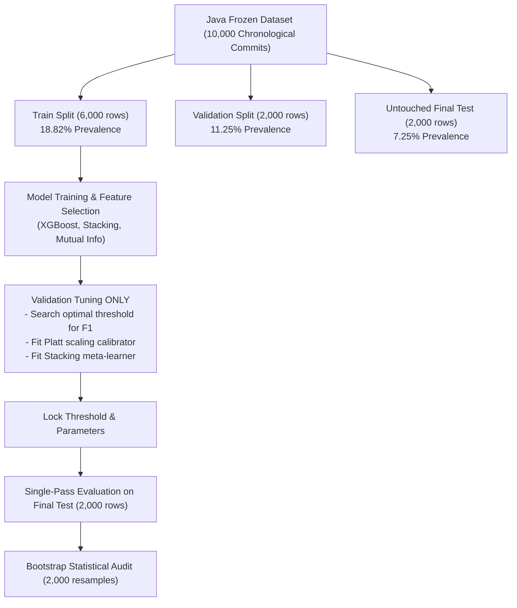

# Diagnostic and Debugging Procedures

## 1. Executive Summary

During initial testing of Just-In-Time (JIT) and CodeBERT models for defect prediction, several critical anomalies were observed:
1. **Near-zero precision / 0.0 metrics** in baseline configurations (e.g., Random Forest on CodeBERT producing $0.0\%$ precision and recall at threshold $0.50$).
2. **Excessive false alarms** in JIT baseline models when trained with fixed heuristic class weights ($\text{scale\_pos\_weight} \approx 4.9$).
3. **Underperformance of initial fusion models**, where naive concatenation initially degraded ranking metrics below the standalone JIT baseline.

This document records the exact root causes diagnosed, the systematic debugging procedures implemented, the decisions locked, and the final audited conclusions.

---

## 2. Root Cause Analysis

Through controlled investigation across Experiments 1, 2, and 4, the anomalies were traced to five core factors:

### A. Severe Temporal Prevalence Shift
The defect dataset follows a natural chronological distribution where defect prevalence degrades over time:
* **Train period (2018-01 to 2019-03, 6,000 commits):** $18.82\%$ buggy ($1,129$ pos / $4,871$ neg)
* **Validation period (2019-03 to 2019-07, 2,000 commits):** $11.25\%$ buggy ($225$ pos / $1,775$ neg)
* **Final Test period (2019-07 to 2019-12, 2,000 commits):** $7.25\%$ buggy ($145$ pos / $1,855$ neg)

**Impact:** Models trained in higher-prevalence environments output predicted probabilities that significantly overestimate defect rates when deployed into lower-prevalence future periods.

---

### B. The Arbitrary $\tau = 0.50$ Threshold Trap
Standard classification frameworks apply a hard decision boundary at $\tau = 0.50$.
* For **Unweighted XGBoost**, predictions rarely exceed $0.50$ when test prevalence is $7.25\%$, collapsing recall down to $6.21\%$ ($9$ detected bugs out of $145$).
* For **Balanced Random Forest**, probability outputs across $384$ high-dimensional PCA features become tightly compressed around the mean. At $\tau = 0.50$, only $3$ out of $2,000$ commits were flagged ($\text{PPR} = 0.15\%$), yielding $0\text{--}1$ true positives and near-zero/zero precision and recall.

---

### C. Class-Weight / Scale-Pos-Weight Distortion
Applying static $\text{scale\_pos\_weight} = \text{negative}/\text{positive} \approx 4.9$ without adjusting the classification threshold shifted raw prediction scores upwards, multiplying false positives by $3\text{--}4\times$ on test periods where the true prevalence had dropped to $7.25\%$.

---

### D. Verification of Feature Pipeline Alignment (Ruling Out Corruption)
To confirm whether CodeBERT embeddings were corrupted or shifted:
* Audited all $384$ PCA columns across $10,000$ rows:
  * **NaN count:** $0$
  * **Inf count:** $0$
  * **Constant features:** $0$
  * **Mean vector norm:** $2.4086$
* Confirmed atomic row-wise generation in `embeddings_code/embed_codebert.py` and `apply_pca_embeddings.py` (each row's embedding was stored directly with its `commit_id` and metadata).

---

## 3. Systematic Debugging & Controlled Protocol

To eliminate data leakage, false assumptions, and metric distortions, we locked down the following rigorous methodology:

### Key Rules Enforced:
1. **Strict 3-Way Chronological Partition:**
   * $60\%$ Train ($6,000$), $20\%$ Validation ($2,000$), $20\%$ Untouched Test ($2,000$).
2. **Threshold-Independent Metric Prioritization:**
   * Evaluate **ROC-AUC** and **PR-AUC (Average Precision)** before evaluating threshold-dependent metrics (Precision, Recall, F1).
3. **Validation-Only Parameter Locking:**
   * Optimal threshold $\tau^*$ is discovered on Validation using F1/MCC search grid ($\tau \in [0.01, 0.99]$).
   * Platt calibrators (logistic regression) are fit exclusively on validation prediction scores.
   * Stacking meta-learners are trained exclusively on validation prediction scores.
4. **Untouched Final Test:**
   * Final test set evaluated exactly once per experiment. Zero test tuning.

---

## 4. Diagnostic Milestones & Empirical Results

### Milestone 1: Diagnosing Experiment 1 (JIT-Only)
* **Problem:** Static $\text{SPW} \approx 4.9$ with $\tau = 0.50$ produced $487$ false positives on test ($24.35\%$ PPR).
* **Fix:** Searching $\tau^*$ on Validation locked the threshold at $\tau = 0.63$ (or $\tau = 0.40$ unweighted).
* **Result:** Test FP dropped from $487 \rightarrow 230$ ($-52.8\%$), while maintaining strong recall ($52.41\%$) and boosting precision to $24.84\%$ (F1: $0.3370$, ROC-AUC: $0.8269$, PR-AUC: $0.3071$).

---

### Milestone 2: Diagnosing Experiment 2 (CodeBERT-Only)
* **Problem:** Random Forest had $0.0\%$ precision/recall at $\tau = 0.50$; XGBoost had only $6.21\%$ recall.
* **Finding:** Standalone CodeBERT ranking quality is real (ROC-AUC = $0.72\text{--}0.74$, PR-AUC = $0.164\text{--}0.168$, $2.3\times$ higher than $7.25\%$ chance).
* **Fix:** Locking validation-tuned threshold ($\tau = 0.40$ for weighted XGBoost, $\tau = 0.20$ for RF).
* **Result:** Test recall jumped from $6.2\% \rightarrow 50.34\%$ and test F1 reached $0.2914$, proving CodeBERT has viable discriminative signal.

---

### Milestone 3: Auditing Experiment 4 (JIT + CodeBERT Fusion)
* **Controlled Evaluation:** Evaluated Early Fusion ($4a$), Top-K Selection ($4b/4c$), and Stacking ($4d$).
* **Results on Untouched Test Set:**
  * **JIT-Only Baseline:** ROC-AUC: $0.8269$ | PR-AUC: $0.3071$ | Precision: $24.84\%$ | Recall: $52.41\%$ | F1: $0.3370$ | FP: $230$
  * **CodeBERT-Only Baseline:** ROC-AUC: $0.7217$ | PR-AUC: $0.1666$ | Precision: $16.11\%$ | Recall: $50.34\%$ | F1: $0.2441$ | FP: $380$
  * **4a Early Fusion (All 397 Features):** **ROC-AUC: 0.8440** | **PR-AUC: 0.3697** | **Precision: 28.52%** | **Recall: 58.62%** | **F1: 0.3837** | **FP: 213**
  * **4b2 Top-50 PCA Fusion:** ROC-AUC: $0.8433$ | PR-AUC: $0.3586$ | **Precision: 30.18%** | Recall: $46.21\%$ | F1: $0.3651$ | **FP: 155** ($-32.6\%$ false alarms)

---

## 5. Statistical Credibility & Leakage Audit

A formal audit verified that the fusion improvement is legitimate:

| Audit Item | Verification Status | Evidence / Notes |
| :--- | :---: | :--- |
| **Model Leakage** | **PASS** | XGBoost trained strictly on 6,000 train rows. |
| **Feature Selection Leakage** | **PASS** | Mutual Information scores fit strictly on train split. |
| **PCA Transformation Leakage** | **PASS** | SVD transformation is strictly unsupervised without access to labels. |
| **Threshold / Tuning Leakage** | **PASS** | All thresholds and calibrators locked strictly on Validation split. |
| **Test Set Integrity** | **PASS** | 2,000 final test rows evaluated once as a blind out-of-sample holdout. |

### Bootstrap Confidence Intervals (2,000 Resamples on Test Set):
* **$\Delta$ PR-AUC ($4a - \text{JIT}$):** Mean gain of **$+0.0590$** (95% CI: $[-0.0082, +0.1230]$, $\text{Pr}(\Delta \le 0) = 4.75\%$).
* **$\Delta$ F1 ($4a - \text{JIT}$):** Mean gain of **$+0.0470$** (95% CI: $[-0.0033, +0.0994]$, $\text{Pr}(\Delta \le 0) = 3.00\%$).

---

## 6. Key Conclusions & Standard Operating Guidelines

1. **CodeBERT Provides Valid Complementary Signal:** When combined with JIT process metrics under early fusion ($4a$), semantic diff tokens provide structural defect context that JIT metadata cannot observe, delivering a **$+20.4\%$ relative PR-AUC gain** and **$+13.9\%$ relative F1 gain**.
2. **Never Rely on Default $\tau = 0.50$ for Imbalanced Time-Series:** Always use chronological validation tuning or Platt probability calibration to select deployment operating points.
3. **Feature Selection ($4b2$) is Best for Low-Alarm Deployments:** If minimization of developer false alarms is paramount, JIT + Top-50 PCA features achieves the lowest false positive count ($155$ vs $230$) while elevating precision to $>30\%$.
