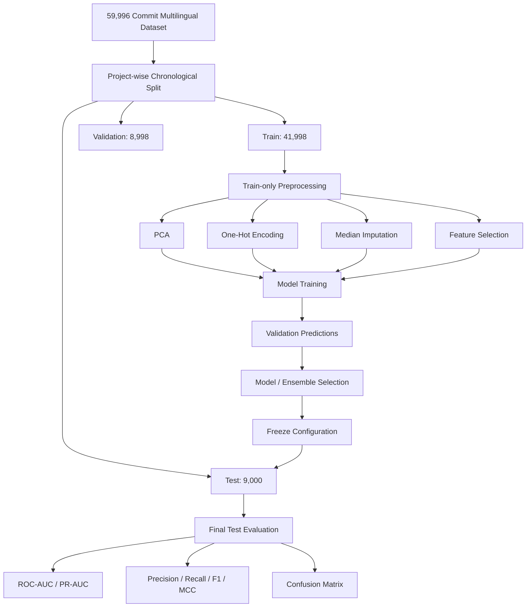

# Diagnostic and Debugging Procedures

## 1. Executive Summary

During the development of the multilingual JIT software defect prediction framework, several diagnostic issues were identified while evaluating the individual feature sources and their fusion:

1. **Near-zero precision / recall in some CodeBERT-only configurations** when using a fixed decision threshold of `0.50`.
2. **Excessive false alarms and degraded threshold-dependent performance** caused by class imbalance and temporal changes in buggy-commit prevalence.
3. **Initial fusion underperformance**, where some naive combinations of JIT and CodeBERT features did not consistently improve over the JIT-only baseline.
4. **Temporal prevalence shift**, with the proportion of buggy commits decreasing from the training period to the later validation and test periods.
5. **Potential preprocessing and feature-selection leakage**, requiring explicit auditing of PCA, categorical encoding, imputation, feature selection, and ensemble-weight selection.

The diagnostic process was therefore expanded from the original 10,000-commit Java-only benchmark to the final **59,996-commit multilingual dataset** and the project-wide chronological evaluation protocol.

The final diagnostic procedure verifies:

- chronological train/validation/test separation;
- train-only PCA fitting;
- train-only categorical encoding and numerical imputation;
- train-only feature selection;
- canonical SZZ label alignment;
- no duplicate commit IDs;
- no overlap between splits;
- no resampling;
- validation-only ensemble-weight selection;
- preservation of the untouched chronological test set.

---

# 2. Final Diagnostic Context

The final dataset contains:

- **59,996 commits**
- Java, C++, and Python projects
- **26,568 buggy commits**
- **33,428 non-buggy commits**
- approximately **2016–2026** temporal coverage

The final chronological partition is:

| Split | Rows | Buggy | Buggy Prevalence |
|---|---:|---:|---:|
| Train | 41,998 | 11,912 | 28.36% |
| Validation | 8,998 | 2,082 | 23.14% |
| Test | 9,000 | 1,376 | 15.29% |
| **Total** | **59,996** | **15,370** | — |

The reduction in buggy prevalence from training to test is an important diagnostic characteristic of the final evaluation.

It is **not corrected using random resampling**, because the objective is to preserve the chronological distribution encountered when predicting future commits.

---

# 3. Root Cause Analysis

The diagnostic investigation identified several important factors.

## 3.1 Temporal Prevalence Shift

The chronological dataset exhibits a substantial change in buggy-commit prevalence:

- Training: **28.36%**
- Validation: **23.14%**
- Test: **15.29%**

Therefore, a classifier trained on the earlier distribution is evaluated on a later period with a lower positive-class prevalence.

This can affect:

- predicted positive rates;
- precision;
- recall at a fixed threshold;
- F1-score;
- confusion-matrix characteristics.

The observed temporal shift is treated as part of the real evaluation setting rather than as an error in the dataset.

---

## 3.2 Fixed Threshold Effects

A probability threshold of:

\[
\tau = 0.50
\]

does not necessarily correspond to an appropriate operating point under class imbalance and temporal prevalence changes.

This was particularly visible in early CodeBERT-only experiments, where some models produced very few positive predictions at the default threshold.

Consequently, the final experimental protocol distinguishes between:

### Threshold-independent metrics

- ROC-AUC
- PR-AUC / Average Precision

and:

### Threshold-dependent metrics

- Accuracy
- Precision
- Recall
- F1
- MCC
- Confusion Matrix

For the frozen final experiments, the reported model results use the common fixed threshold of `0.50`. Validation is used for ensemble/model selection rather than using the final test set for threshold tuning.

---

## 3.3 Class Weighting Effects

Class imbalance is handled through the model configurations rather than through oversampling or undersampling.

For XGBoost and LightGBM:

\[
\text{scale\_pos\_weight}
=
\frac{N_{\text{negative}}}{N_{\text{positive}}}
\]

For the final training split:

\[
\text{scale\_pos\_weight}
=
\frac{30086}{11912}
\approx 2.526
\]

Random Forest uses:

```text
class_weight = balanced
```

The final experiments do not use the earlier heuristic value of approximately `4.9` from the obsolete 10,000-commit Java-only methodology.

---

# 4. Feature Pipeline Audit

A major part of debugging was determining whether poor model performance originated from corrupted or misaligned feature data.

The final feature pipeline was audited across the following components:

1. Traditional JIT metrics
2. CodeBERT embeddings
3. PCA transformation
4. LLM semantic features
5. SZZ labels
6. Commit-ID alignment
7. Train/validation/test membership

---

## 4.1 JIT Feature Verification

The final JIT representation contains exactly **12 features**:

```text
la
ld
nf
ns
nd
ent
ndev
age
nuc
aexp
arexp
asexp
```

The obsolete `fix` feature is not included in the final frozen experiments.

JIT features are extracted and aligned using `commit_id`.

---

## 4.2 CodeBERT Embedding Verification

The original CodeBERT representation contains:

\[
768
\]

dimensions per commit.

The final representation uses:

\[
384
\]

PCA components.

The PCA transformation is fitted exclusively using training data.

Validation and test embeddings are transformed using the already-fitted training PCA model.

This prevents validation or test observations from influencing the learned PCA transformation.

---

## 4.3 LLM Feature Verification

The complete model-ready LLM representation contains:

\[
51
\]

features:

\[
37\text{ one-hot categorical}
+
7\text{ confidence}
+
7\text{ margin}
=
51
\]

The categorical encoder is fitted only on training data.

Numerical missing-value imputation is also fitted only on training data.

The LLM dataset was aligned against the canonical commit IDs and SZZ labels.

---

# 5. Label and Dataset Alignment Audit

The canonical SZZ-labelled dataset is treated as the authoritative source of the `buggy` target.

For every experiment involving multiple feature sources:

1. Commit IDs are matched across the feature sources.
2. Row counts are verified.
3. Duplicate commit IDs are checked.
4. Missing matches are checked.
5. Buggy labels are compared against the canonical labels.
6. Train/validation/test membership is preserved.

The final dataset contains:

- **59,996 unique commit IDs**
- **0 duplicate commit IDs**
- complete alignment across the final feature sources.

Commit IDs are used for alignment and verification only and are never supplied to the predictive models.

---

# 6. Temporal Split Audit

The final split uses project-wise chronological partitioning.

For each project:

```text
Oldest 70%  → Training
Next 15%    → Validation
Newest 15%  → Test
```

The sorting procedure uses:

1. parsed `author_date`;
2. deterministic source-row ordering as a tie-breaker for equal timestamps.

The following checks are performed:

- chronological ordering within projects;
- no train/validation overlap;
- no train/test overlap;
- no validation/test overlap;
- correct project membership;
- expected split sizes;
- preservation of source-row identity.

The final split therefore represents a future-oriented prediction setting rather than an IID random split.

---

# 7. Preprocessing Leakage Audit

Every preprocessing operation that learns parameters from data is restricted to the training split.

| Operation | Fitting Data | Validation/Test Usage |
|---|---|---|
| PCA | Train only | Transform |
| One-hot encoding | Train only | Transform |
| Numerical imputation | Train only | Transform |
| Mutual Information | Train only | Select |
| Correlation filtering | Train only | Apply |
| Ensemble weight selection | Validation only | Frozen before test |

No test observation is used to fit any preprocessing transformation.

---

# 8. Systematic Debugging Procedure

The final debugging workflow can be summarized as:



---

# 9. Diagnostic Milestones

## Milestone 1 — JIT-Only Baseline

Experiment 1 established the traditional JIT baseline using:

\[
12
\]

JIT features.

The final chronological test results were:

### Random Forest

- Accuracy: `0.7402`
- Precision: `0.3178`
- Recall: `0.6097`
- F1: `0.4178`
- MCC: `0.2952`
- ROC-AUC: `0.7681`
- PR-AUC: `0.3651`

### XGBoost

- Accuracy: `0.6891`
- Precision: `0.2949`
- Recall: `0.7427`
- F1: `0.4221`
- MCC: `0.3122`
- ROC-AUC: `0.7806`
- PR-AUC: `0.3802`

The results establish a reproducible traditional JIT baseline under the final multilingual chronological protocol.

---

# 10. Milestone 2 — CodeBERT-Only Diagnostic

Experiment 2 evaluates:

\[
384
\]

PCA-reduced CodeBERT features without traditional JIT metrics.

The early experiments demonstrated that threshold-dependent results could be substantially different from the underlying ranking quality.

Final test results under the common frozen protocol were:

### Random Forest

- Accuracy: `0.8140`
- Precision: `0.3307`
- Recall: `0.2115`
- F1: `0.2580`
- MCC: `0.1626`
- ROC-AUC: `0.6987`
- PR-AUC: `0.2669`

### XGBoost

- Accuracy: `0.6744`
- Precision: `0.2584`
- Recall: `0.6039`
- F1: `0.3619`
- MCC: `0.2186`
- ROC-AUC: `0.7134`
- PR-AUC: `0.2783`

The diagnostic conclusion is that poor threshold-dependent behavior in some CodeBERT configurations should not automatically be interpreted as evidence that the representation contains no useful information.

Ranking metrics and class-prevalence effects must be considered separately.

---

# 11. Milestone 3 — Initial JIT + CodeBERT Fusion

Experiment 4 investigated whether CodeBERT and traditional JIT metrics provide complementary information.

The following configurations were evaluated:

- **4A:** JIT + all 384 CodeBERT PCA features
- **4B1:** JIT + first 25 PCA components
- **4B2:** JIT + first 50 PCA components
- **4C:** Mutual Information-selected features
- **4D:** Probability stacking
- **4E:** Weighted JIT/CodeBERT probability blending
- **4F:** Weighted RF/XGB/LightGBM probability blending

The complete early-fusion representation contains:

\[
12 + 384 = 396
\]

features.

The experiments showed that fusion performance depends on the representation and fusion strategy rather than automatically improving through simple concatenation.

This motivated the later investigation of:

- reduced CodeBERT representations;
- probability-level fusion;
- LLM semantic features;
- compact LLM representations;
- redundancy-aware feature selection.

---

# 12. LLM Diagnostic Investigation

The LLM diagnostic was performed to determine whether the 51 extracted features contained meaningful defect-related information and whether all 51 features were necessary.

The 51 features consist of:

\[
37\text{ categorical}
+
14\text{ confidence/margin}
\]

Train-only univariate analysis showed measurable signal in several LLM confidence and margin features.

Examples included:

- `complexity_confidence`
- `complexity_margin`
- `risk_confidence`
- `security_confidence`
- `scope_confidence`
- `scope_margin`
- `risk_margin`

The diagnostic also identified substantial dependence between several categorical dimensions.

For example, the train-only categorical analysis showed high association between:

- risk and security;
- complexity and scope;
- change and complexity;
- change and scope;
- risk and test.

This motivated the controlled compactness experiments performed in Experiments 8 and 9.

---

# 13. Experiment 8 Diagnostic

Experiment 8 reduced the LLM representation from:

\[
51 \rightarrow 14
\]

using only the seven confidence and seven margin features.

This represents a:

\[
72.55\%
\]

reduction in LLM feature dimensionality.

The complete representation became:

\[
12 + 384 + 14 = 410
\]

features.

Final Experiment 8 weighted-blend test results:

| Metric | Result |
|---|---:|
| Accuracy | `0.718000` |
| Precision | `0.322324` |
| Recall | `0.765988` |
| F1 | `0.453724` |
| MCC | `0.355666` |
| ROC-AUC | `0.804632` |
| PR-AUC | `0.402680` |

Confusion matrix:

```text
[[5408, 2216],
 [ 322, 1054]]
```

The result indicates that a substantial reduction in LLM dimensionality can retain comparable predictive performance in the full JIT + CodeBERT fusion setting.

The appropriate conclusion is **compactness with comparable performance**, rather than claiming that feature reduction itself universally improves predictive performance.

---

# 14. Experiment 9 Diagnostic

Experiment 9 investigated whether a generic redundancy-aware feature-selection strategy could further improve the compact LLM representation.

The procedure was:

1. Start with all 51 LLM features.
2. Compute train-only Mutual Information.
3. Apply Pearson correlation filtering at:

\[
|r| \geq 0.90
\]

4. Retain the higher-MI feature among highly correlated candidates.
5. Reduce 51 features to 44 non-redundant candidates.
6. Select the top 14 features using training Mutual Information.

The resulting representation remained:

\[
12 + 384 + 14 = 410
\]

features.

Final weighted-blend test results:

| Metric | Result |
|---|---:|
| Accuracy | `0.718111` |
| Precision | `0.321878` |
| Recall | `0.762355` |
| F1 | `0.452643` |
| MCC | `0.353793` |
| ROC-AUC | `0.803065` |
| PR-AUC | `0.395830` |

Confusion matrix:

```text
[[5414, 2210],
 [ 327, 1049]]
```

Compared with Experiment 8, Experiment 9 produced slightly different results but did not provide an improvement across the reported metrics.

Therefore, the controlled conclusion is:

> Generic Mutual Information and correlation-based redundancy filtering did not demonstrate an additional performance improvement over the simpler 14-feature confidence/margin representation.

This does **not** support a general claim that redundancy-aware feature selection improves performance.

---

# 15. Comparison of Compact LLM Experiments

The final compact LLM experiments are summarized below.

| Configuration | LLM Features | Accuracy | F1 | MCC | ROC-AUC | PR-AUC |
|---|---:|---:|---:|---:|---:|---:|
| Experiment 7F | 51 | 0.7157 | 0.4519 | 0.3535 | 0.8049 | 0.4052 |
| Experiment 8 | 14 confidence/margin | 0.7180 | 0.4537 | 0.3557 | 0.8046 | 0.4027 |
| Experiment 9 | 14 MI/correlation-selected | 0.7181 | 0.4526 | 0.3538 | 0.8031 | 0.3958 |

The main observation is that reducing the LLM representation from 51 to 14 features substantially reduces dimensionality while maintaining comparable performance.

Experiment 9 does not provide evidence of a further benefit from generic redundancy-aware selection.

---

# 16. Full Three-Way Fusion Diagnostic

Experiment 7 evaluated the complete representation:

\[
12\text{ JIT}
+
384\text{ CodeBERT}
+
51\text{ LLM}
=
447\text{ features}
\]

The experiment evaluated:

- Random Forest
- XGBoost
- LightGBM
- reduced CodeBERT variants;
- Mutual Information feature selection;
- probability stacking;
- weighted probability blending.

The full three-way fusion results demonstrated that adding more features does not necessarily guarantee improved predictive performance.

This observation motivated the compactness analysis in Experiments 8 and 9.

---

# 17. Ensemble Diagnostics

The later experiments use three base classifiers:

- Random Forest
- XGBoost
- LightGBM

Two decision-level strategies were evaluated.

## 17.1 Probability Stacking

Validation probabilities are supplied to a Logistic Regression meta-learner.

The meta-learner is not trained using test predictions.

## 17.2 Weighted Probability Blending

Weights are selected using the validation set.

For Experiment 7F, the selected weights were:

```text
Random Forest = 0.15
XGBoost       = 0.35
LightGBM      = 0.50
```

For Experiment 8:

```text
Random Forest = 0.15
XGBoost       = 0.40
LightGBM      = 0.45
```

For Experiment 9:

```text
Random Forest = 0.10
XGBoost       = 0.80
LightGBM      = 0.10
```

These weights are selected before final test evaluation and are not tuned using test performance.

---

# 18. Final Leakage Audit

The final methodology was audited against the major sources of experimental leakage.

| Audit Item | Status | Verification |
|---|:---:|---|
| Chronological split | **PASS** | Project-wise 70/15/15 |
| Train/test overlap | **PASS** | No overlapping commit IDs |
| Duplicate commits | **PASS** | 0 duplicate commit IDs |
| PCA leakage | **PASS** | PCA fitted on training data only |
| One-hot encoding leakage | **PASS** | Encoder fitted on training data only |
| Imputation leakage | **PASS** | Median values fitted on training data only |
| MI feature-selection leakage | **PASS** | MI calculated using training data only |
| Correlation-selection leakage | **PASS** | Correlations calculated using training data only |
| Label alignment | **PASS** | Canonical SZZ labels verified |
| Resampling leakage | **PASS** | No resampling used |
| Ensemble-weight leakage | **PASS** | Weights selected on validation only |
| Test tuning | **PASS** | Test reserved for final evaluation |

---

# 19. Diagnostic Findings

The debugging process resulted in the following methodological findings.

### Finding 1 — Temporal prevalence must be preserved

The decline in buggy prevalence from:

\[
28.36\% \rightarrow 23.14\% \rightarrow 15.29\%
\]

is retained as part of the chronological evaluation rather than artificially corrected through resampling.

### Finding 2 — Threshold-dependent metrics require contextual interpretation

A fixed probability threshold can produce substantially different precision and recall as the future defect prevalence changes.

Therefore, ROC-AUC and PR-AUC are reported alongside threshold-dependent metrics.

### Finding 3 — CodeBERT contains useful semantic information

CodeBERT-only models produce measurable ranking performance, although their results differ from traditional JIT features.

The final experiments therefore evaluate CodeBERT as a complementary semantic representation rather than assuming that it must independently outperform JIT metrics.

### Finding 4 — Feature fusion is not automatically beneficial

Adding features through simple concatenation does not guarantee improvement.

Different representations and fusion strategies therefore need to be evaluated empirically.

### Finding 5 — LLM feature dimensionality can be substantially reduced

The 51-feature LLM representation can be reduced to 14 confidence/margin features while maintaining comparable performance in the complete JIT + CodeBERT setting.

### Finding 6 — Generic redundancy-aware selection did not demonstrate additional gain

Experiment 9 did not improve over Experiment 8 across the reported test metrics.

Therefore, the results support the statement that **compactness can be achieved without requiring generic redundancy-aware feature selection**, rather than claiming that redundancy-aware selection improves performance.

---

# 20. Standard Operating Guidelines

The final experimental pipeline follows these guidelines:

1. **Use project-wise chronological splitting** rather than random splitting.
2. **Fit PCA only on training data.**
3. **Fit categorical encoders only on training data.**
4. **Fit numerical imputers only on training data.**
5. **Perform feature selection only on training data.**
6. **Use validation data for ensemble/model-selection decisions.**
7. **Keep the final test period untouched until evaluation.**
8. **Do not use test performance to select features, weights, thresholds, or models.**
9. **Report PR-AUC together with ROC-AUC because of the observed class imbalance.**
10. **Report threshold-dependent metrics together with confusion matrices.**
11. **Do not interpret a poor result at one threshold as proof that the representation contains no ranking signal.**
12. **Do not claim that additional features necessarily improve predictive performance.**
13. **Treat compactness and predictive performance as separate evaluation objectives.**

---

# 21. Final Diagnostic Conclusion

The debugging process established a controlled multilingual JIT-SDP evaluation framework in which the major sources of leakage, preprocessing errors, feature misalignment, and temporal evaluation bias are explicitly addressed.

The final experiments show that:

- traditional JIT metrics provide a strong baseline;
- CodeBERT provides complementary semantic information;
- LLM-derived features contain measurable defect-related signal;
- full feature fusion does not automatically improve every metric;
- the 51-feature LLM representation can be reduced to 14 confidence/margin features with comparable predictive performance;
- generic Mutual Information plus correlation-based redundancy filtering did not demonstrate a further improvement over this compact representation.

The resulting methodology emphasizes **controlled comparison, chronological validity, leakage prevention, and empirical evaluation of feature complementarity**, rather than assuming that a larger or more complex feature representation will necessarily produce better defect prediction.
